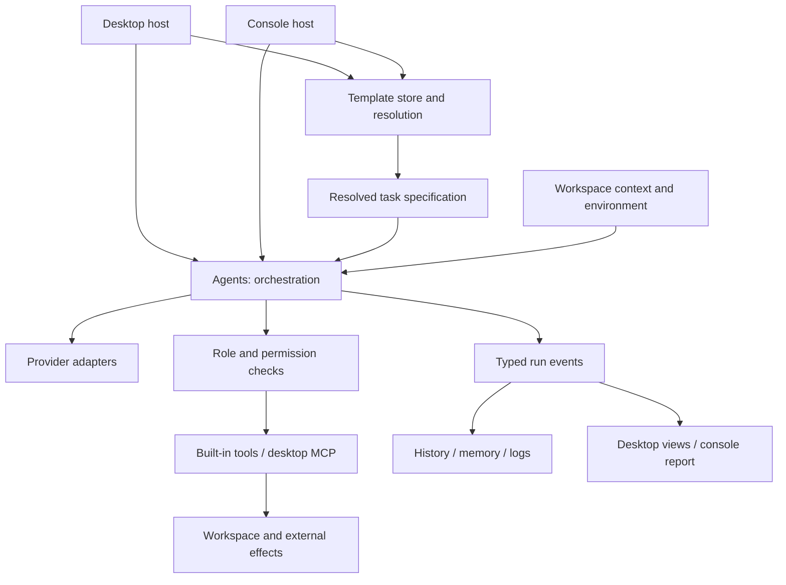

# Architecture and Execution

[Wiki home](README.md)

## System structure

Enactive is a .NET application with shared domain and execution libraries, a desktop host, and a console host. The remote gateway is an ASP.NET Core application in the same solution, deployed separately to a server; see [Remote access](Remote-Access.md).

### Projects

| Project | Responsibility |
| --- | --- |
| `Enactive.Core` | Domain records and interfaces: intents, context, plans, workers, model references, permissions, templates, evidence, events, reports, and budgets |
| `Enactive.Agents` | Planner, scheduler, orchestrator, reviewer, model routing, success evaluation, recording, and background decision handling |
| `Enactive.Providers` | OpenAI-compatible Chat Completions, native Ollama, and Anthropic adapters; provider factory; model discovery; logging |
| `Enactive.Tools` | File, shell, Git, Docker, and MCP tooling with a registry |
| `Enactive.Workspace` | Template files, run/memory/Inbox persistence, artifact stores, workspace registry, context, environment discovery, and logging |
| `Enactive.Secrets` | Protection of persisted secrets with Windows DPAPI |
| `Enactive.App.Ui` | Avalonia views, view models, settings editors, and desktop service composition |
| `Enactive.App.Console` | Command-line composition and interactive/unattended execution |
| `tests/Enactive.Engine.Tests` | xUnit coverage of execution behavior and regressions |
| `tests/Enactive.Mcp.TestServer` | Local fixture used to exercise MCP integration |
| `Enactive.Remote.Contracts` | Messages, faults, lifecycle states, and action identity shared by the gateway and the host |
| `Enactive.Remote.Gateway` | ASP.NET Core gateway over MySQL, with the browser panel it serves |
| `Enactive.Remote.Host` | The half that lives inside the desktop application: outbound connection, local outbox, remote runs, and remote approvals |
| `tests/Enactive.Remote.Gateway.Tests` | Gateway coverage against a real MySQL instance |

The desktop follows MVVM with a small in-repository observable-object/command layer. XAML uses compiled bindings. Code-behind handles operations that require windows or controls and composes execution services.

## From a request to an outcome

### 1. Capture the request

The desktop uses command text or a resolved template goal. The console uses positional command text or resolves `--template`. The host selects the workspace, worker, permissions, artifact store, and model configuration.

For template launches, the recorder also receives the frozen specification. Providers and phase bindings are not embedded in that specification.

### 2. Assemble context

The context provider supplies workspace identity, project name, available focus/selection, Git branch, and best-effort environment information. The environment probe discovers host/OS and available Git, Docker, WSL, and service information.

This is not full repository indexing. `RelatedFiles` and `RecentChanges` are currently empty in `ContextProvider`; the worker must use file tools to inspect the source relevant to a task. Persistent project memory should not be mistaken for automatic retrieval of every past run into the next prompt.

### 3. Plan

The Plan model classifies the request as a quick action or builds a task plan. A task plan contains steps with dependencies and complexity ratings.

- A blank Plan binding uses the selected worker's base model.
- A blank binding does not remove planning.
- An unreadable planner response is handled explicitly; fallback to a single action is reported rather than silently presented as a valid parsed plan.

The planner receives assembled context. It is not a separate browsing worker that first explores the entire repository through tools.

### 4. Schedule

`DagScheduler` dispatches steps whose dependencies are satisfied. Failed dependencies cause dependent steps to be skipped. Cycles/unresolvable dependencies are reported.

`MaxParallelSteps = 1` runs sequentially. Higher values allow independent branches to overlap. Concurrent steps receive separate conversations seeded with context and a digest of completed steps. This isolates conversation state, but it does not create separate filesystem checkouts. Plan independent file ownership when enabling concurrency.

### 5. Resolve the execution model

Normal steps use the worker's model. A configured Execute light model serves trivial steps; Execute heavy serves complex steps. A quick action uses the base execution path rather than DAG complexity routing.

Routing changes the model, not the worker's tools or role instructions. Worker fallback is used on supported execution-provider failures; it is not a general failover mechanism for all phases or a response to a failed reviewer verdict.

### 6. Execute tools

The model receives the tools allowed for its worker and performs a streaming conversation/tool loop. The engine checks role access, policy, and any required user decision before invoking a tool.

| Tool group | Tool names | Purpose |
| --- | --- | --- |
| Inspect files | `read_file`, `search_files`, `list_dir` | Read windows of a file, find content, and inspect directory entries |
| Modify files | `write_file`, `edit_file`, `create_directory`, `move_file`, `copy_file` | Create/replace content, make focused edits, and organize files |
| Remove a file | `delete_file` | Delete one file. Always asks first, at every autonomy tier |
| Put a file back | `restore_file` | Return a file to exactly how it was before the run first changed it, from the copy the engine kept |
| Shell | `run_command`, `run_powershell` | Execute commands; PowerShell has its own script transport |
| Tests | `run_tests` | Run the workspace's tests the way its ecosystem runs them, and answer with the totals and each failed test - its message and where it failed |
| Development operations | `git`, `docker` | Invoke version-control and container operations |
| Web | `fetch_url`, `web_search` | Read a public page as text; search through a SearXNG server. Only when turned on in Settings → Web and given to a role — see [Operations → Web](Operations.md#web-tools-and-searxng) |
| External tools | `mcp__...` | Tools discovered from configured MCP servers in the desktop host |

Use `edit_file` for a small change to an existing file. Asking a small model to rewrite the whole file increases the chance of losing unrelated content.

Use `copy_file` rather than reading a file and writing it back. `read_file` returns a window of at most 8000 characters, so a read-then-write copy of a larger file silently produces a shortened one that can still look complete. `copy_file` streams bytes and never decodes them.

`delete_file` asks for approval at every tier, including Autonomous, and no policy setting turns that off. Every other file tool leaves something a person can look at and judge; this one leaves an absence. The question says what it takes: for each file, whether it was there before the run, whether the run has changed it since, and its size and line count — not only its path.

Whether a file was there before the run is measured, not inferred from the engine's own record. The record holds what the file tools wrote; a file a command made — a project template from `dotnet new`, a generated report — or changed is not in it. So every run takes a snapshot of the workspace when it begins (in git, a tree written to a private index; outside git, every file's size, time and hash), and every answer to "was this here before the run" is held against it: the removal question, the change limit (a file the run made is never asked about, whatever made it), `restore_file`, and the list of files the run produced. A file not there when the run began was made by the run; one there and changed since by a command is said to be changed, with no copy to put back. Where the snapshot does not reach — a folder git ignores, a workspace too large to scan — a file the file tools did not touch is said to be not known, rather than to have been there. The snapshot is kept beside the run's undo record (`.enactive/undo/<run id>/start.json`), so a resumed run measures from where the run it carries on began.

Use `restore_file` to undo a change made on purpose — a temporary break to check that a test catches it, an experiment — instead of editing the file back by hand. It writes the bytes the engine kept from before the run, through the store like any write. It does not remove a file the run created (there was nothing before it), and it cannot undo a change made by a shell command, which is not journalled.

Every file tool writes through the artifact store, so a step a reviewer rejects can be undone — including a deletion, which is restored with its contents. Shell effects are not journalled and cannot be undone.

One area is deliberately outside all of that: `.enactive/scratch/`, the worker's own working area. The state folder around it stays closed to tools; this one folder is open, and writes to it go straight to disk. They are not staged, not journalled, not counted among the paths the step changed, and not reverted when a step is rejected. It exists because a helper script, a scratch copy or a command's captured output had nowhere to go but the user's project, where a throwaway became a change the reviewer had to judge. Under staging it also matters that the write lands immediately: a staged script does not exist for the command written to run it. Use the workspace proper for the deliverable and this folder for everything that only serves the work.

Two consequences follow from its being unstaged. `delete_file` works there even in a run that stages its changes — there is no proposal to be unable to express, so an agent that may create a working file can also clear it up; everywhere else under staging the refusal stands. And `search_files` leaves it out of a whole-workspace sweep, so a long captured log cannot spend the match and character caps on the worker's own notes, but searches it when you name it with `path` — which is how you find an error in a build log too long to read a window at a time.

Nothing in the area survives a week. The first write that goes there in a run removes entries nothing has touched for seven days, taking a folder's age from the newest file anywhere inside it rather than from the folder itself. It is swept by age rather than emptied per run because a background run and a foreground one can share a workspace, and the second to start would otherwise delete the first's scripts while they were in use.

`run_command` uses `cmd.exe` on Windows and a shell on Unix. `run_powershell` avoids embedding PowerShell syntax into a cmd command string. Starting a shell in the workspace is not OS-level containment of everything that shell can do.

`run_tests` is offered wherever the engine knows a kind of project (for now .NET). It finds the test projects, builds the command - one project with `target`, only the tests whose name contains `filter` - and reads what the run printed: the answer is the totals and each failed test with its message and its file and line, and the whole output is kept in the scratch. Failing tests are its finding, not its failure; a build that failed is a failure, and names the errors that stopped it. Where no test project is known it says so, and `run_command` is the way. Tests run through `run_command` or `run_powershell` whose output was too long to show are answered the same way - to the model only: the final checks and the reviewer read everything the command printed. For permissions `run_tests` counts as a shell: it runs the workspace's own code, so it asks where the shells ask and is denied where they are.

When the plan says the tests must pass, that final check is about the test projects there are when the final checks run, not when the plan is read: a plan whose own steps make the test project is checked against it, and a test project the run adds beside an existing one is run too. Each project's tests run the way its ecosystem runs them, and the check passes only if every one passes. A test project the plan named that is not there fails the check and names the ones that are; no test project at all is NOT CHECKED - nothing was there to run. The contract review is shown this check and what it runs, so it adds no second test run of its own.

### 7. Keep evidence and apply execution guards

Each step has an execution journal recording tool calls, arguments, results, and outcomes as they occur. The review evidence is separate from the conversational transcript, so trimming the prompt does not remove the underlying journal.

The engine distinguishes real tool failure from an informative absence, such as a lookup that finds no matching file. Unrecovered failures prevent a step from claiming completion. Repeating already performed calls without progress triggers a stall guard; successful writes advance the progress generation so a legitimate edit/build repair loop can proceed.

When the request limits what may be changed — "leave this file alone", "do not change the source to make a test pass" — the review of the final checks records each such sentence verbatim as a change limit. With a limit in place, the first change a step makes to a file that existed before the run is put to the planning model before it runs: the request, the limit, the step, what the step said it was doing, and the change. A change that goes against the limit is refused with the reason, and the step carries on. A file the run created, the engine's own folder, and `restore_file` are never asked about; once a change to a file is allowed it is not asked about again in that step — but taking the file away (deleting it, or moving it from where it is) is asked about separately; three refusals of one file in one step and the limit stands without asking; if no usable answer comes back, the change goes ahead and the run says so. A request with no such limit asks nothing.

Commands may declare `expectedExitCodes` before execution when a nonzero exit is a meaningful result. This is evidence about expected behavior, not permission to relabel any failed operation after the fact.

Truncated model output stops the step rather than executing a partially formed tool call. Ordinary prose or a JSON example in an assistant response does not execute by default.

### 8. Review and retry

When a Review model is bound, every step - and a quick action - gets one short verdict: did the step do what it is for, and is what it reported true? The reviewer answers pass or fail with a reason, citing the recorded calls and the files that show it. A claim counts only where a call or a file shows it; a call that was refused, or a tool that failed without running anything, shows nothing done.

The reviewer is shown the request as context, the step and what the plan says it is (one item of a fan-out, or a read-only step), the lines of the request the plan gave this step, the other steps, the worker's report and any values it handed on, the files the step changed - as a diff, with the whole file where it fits, new files, deletions, and who made each change - and the step's tool calls with their output. A change the request did not ask for, where the request limits what may change, fails the step.

A run is **Completed** when every step passed and the engine's own checks are green; there is no second review of the whole run. When it is not, the outcome names each step that is not done and each check that failed. A review that gives no usable answer leaves its step **done, not verified**: the steps after it still run, but the run is not Completed.

The reviewer may also answer **unreachable**: the step did all that can be done within the request, and what is left of its purpose cannot be reached here without going beyond the request or what the workspace can do (a coverage figure the project's untestable code keeps out of reach, for example). Such a step is not tried again — a retry could only go beyond the request; it ends incomplete with what was reached and why, and what it did stays. A check the workspace cannot give within the request — a build that failed before the work, in code the request says to leave — is not held against a step that says it could not be checked. A step that reported itself blocked with nothing the engine found behind it, and that the review fails, is tried again like any other.

A rejection may trigger another execution attempt with feedback. `ReviewRetries = 1` allows one retry, or two attempts in total. Increasing retries increases worker and reviewer calls; it does not improve an inherently unsuitable reviewer.

Revert rejected steps attempts to undo tracked writes from a finally rejected step - unless the reviewer said the work itself stands and only the report was wrong, in which case the files are kept. Revert refuses to overwrite later writes or subsequent user edits and reports files it cannot safely restore. Shell and MCP side effects are outside this journal.

### 9. Run success criteria

Template criteria are shell commands executed through `run_command` and the permission gate at the end of execution. An exit code matching `ExpectedExitCode` passes. A required failed criterion prevents Completed; an unavailable or denied required check makes verification incomplete. Optional results are reported without controlling completion.

Success criteria are an engine-level check, not another worker conversation. They use the run's tool registry and policy; do not assume the selected worker's tool allowlist by itself disables checks. Use the template's permission policy when a command must be forbidden.

### 10. Persist and present

`RunRecorder` saves events and results, plus run settings and the template snapshot when provided. The UI renders execution cards, history, routing, and artifacts from those records. Console output ends with a report and outcome-based exit code.

## Limits are scheduling boundaries

Template limits cover steps, cumulative reported tokens, and elapsed duration. Token accounting includes planning, execution, and review. These limits are checked at engine boundaries; they are not hard provider billing limits or guaranteed mid-request cancellation timers. In-flight work and parallel branches can overshoot. Providers that omit token usage reduce the precision of token accounting.

## Implementation references

- [Orchestrator](../src/Enactive.Agents/Orchestrator.cs), [Planner](../src/Enactive.Agents/Planner.cs), [DAG scheduler](../src/Enactive.Agents/DagScheduler.cs)
- [Step review](../src/Enactive.Agents/StepVerdictReview.cs), [Execution journal](../src/Enactive.Core/ExecutionJournal.cs)
- [Success evaluator](../src/Enactive.Agents/SuccessEvaluator.cs), [Run budget](../src/Enactive.Core/RunBudget.cs)
- [Context provider](../src/Enactive.Workspace/ContextProvider.cs), [Workspace guard](../src/Enactive.Core/WorkspaceGuard.cs)
