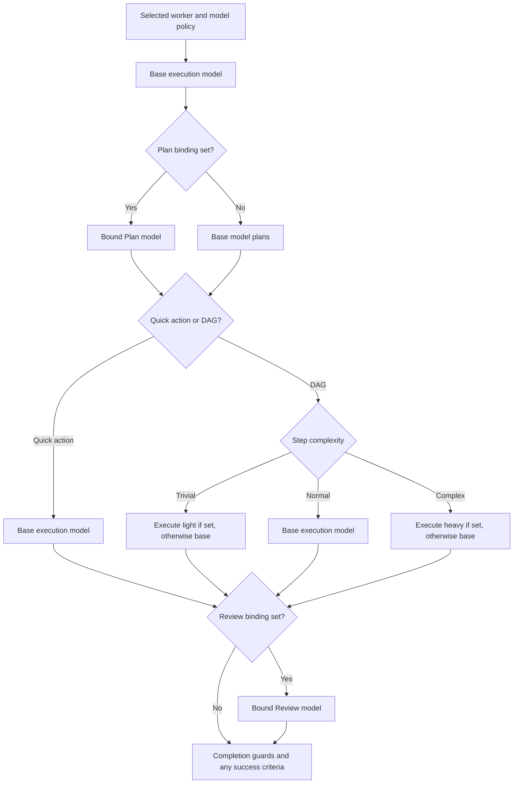

# Choosing Models by Phase and Role

[Wiki home](README.md)

## Recommended starting point

For ordinary development, start with a capable tool-using worker, a strong planning model, and the strongest evidence-reading reviewer you can justify. Leave Execute light/heavy empty until the base configuration is reliable, then introduce routing to reduce repeated execution cost.

For a local-first setup, use a local coder for execution and a stronger remote model for Plan/Review if sending task context and evidence to that provider is acceptable. For a fully local setup, use your strongest local model for Review and put more weight on deterministic success criteria.

These are engineering recommendations based on the responsibilities and failure modes of Enactive's engine. They are not comparative benchmarks collected by this documentation work.

## Three independent choices

| Choice | Question it answers | Configured in |
| --- | --- | --- |
| Worker role | What kind of work and tools should this agent have? | AI → Team, then the main role picker |
| Worker model | Which model normally executes this worker's task? | AI → Team |
| Phase models | Who plans, evaluates, and handles unusually easy/hard steps? | AI → Phases |

You do not need three providers to use three phases. One provider can supply several models, or one model can fill every responsibility. Conversely, a single selected worker can route steps to several providers.

## Exact routing rules



Blank Plan means “plan with the base worker model,” not “skip Plan.” Blank Review skips model review. Blank light/heavy means the worker model serves those steps. Model fallback is an execution failure route; it is not an additional complexity tier.

## Model selection by phase

### Plan: decomposition and judgment

The planner decides whether the request is a quick action or a multi-step task. For a task it must produce a usable dependency graph and classify step complexity.

Prefer a model that can:

- Interpret ambiguous goals without inventing requirements.
- Separate dependent steps from genuinely independent work.
- Produce consistent structured plan output.
- Avoid needless fragmentation into many costly steps.
- Recognize when a step needs a stronger execution model.

For a small documentation edit, the worker model may be sufficient. For cross-cutting refactoring, migration analysis, or multi-component diagnosis, a stronger planner usually deserves priority because a poor plan creates extra work for every later phase.

The planner sees the host's assembled context, not a complete index of repository source. State key constraints and relevant paths in the request; a larger planner cannot reason from files it has not been given.

**Preferred model class:** strong general reasoning/coding model. A balanced cloud model is a practical default; promote difficult tasks to a flagship or your strongest tested local model.

### Execute: reliable tool use

Execution accounts for repeated reads, edits, commands, and repairs. The model must emit real tool calls, obey schemas, preserve existing content, and use returned evidence instead of inventing results.

Prioritize:

- Structured function/tool calling under the actual endpoint and adapter.
- Precise edits, especially `edit_file` instead of full-file rewrites.
- Correct shell choice and argument construction.
- Recovery from failed commands and honest reporting of unresolved failures.
- Latency across many turns, rather than only the speed of one text answer.

**Preferred model class:** a capable coding model for Developer/Ops; a strong instruction-following writing model that can also use file tools for Writer. Local execution is a useful place to save remote usage, provided the model completes representative tasks without excessive retries.

### Execute light: low-risk, bounded steps

Use a smaller/faster tool-capable model for steps such as reading a known file, collecting a short inventory, or making a mechanical, narrowly specified text change.

Do not assume every step marked trivial is harmless. The planner's classification controls this route, and a short instruction can still change a consequential file. Keep the worker's normal restrictions and review/checks in place.

**Preferred model class:** your cheapest reliable tool-using model. If the smaller model mishandles schemas or spends several turns repairing a simple call, leave light unset.

### Execute heavy: difficult implementation

Use a stronger model for steps with multi-file reasoning, unfamiliar code, nontrivial test design, concurrency, or diagnosis across several components.

**Preferred model class:** a high-capability coding/reasoning model. Compare its extra per-call cost with the retry and investigation cost of leaving the work on a weaker executor.

Heavy routing is selected by plan complexity, not by observing execution failure. A normal step that proves harder than expected does not automatically become complex; worker fallback also does not turn reviewer rejection into automatic model promotion.

### Review: evidence and calibrated verdicts

Review compares what the worker claims with what the step actually did. It must interpret exit codes, outputs, failures, recovered operations, and the relevant evidence scope. With content review on, it also evaluates written text for unsupported or incorrect claims.

This phase should receive one of the strongest models in the team. A weak reviewer can reject correct work, approve unsupported work, or send an executor into a repeated repair loop for the wrong reason.

Prefer a model that:

- Reads long, mixed evidence carefully and keeps numeric details straight.
- Distinguishes “failed,” “not checked,” and “passed.”
- Evaluates the step actually requested rather than expanding its scope.
- Recognizes recovery and expected nonzero command results.
- Produces actionable rejection feedback and accepts valid fixes.

An independent stronger reviewer is particularly useful when execution uses a small local model. Using the same model in both roles is still possible, but should not be mistaken for independent verification.

**Preferred model class:** strong reasoning/evidence-reading model, normally flagship-class for consequential work. Model review remains judgment, so build/test checks are still needed where the outcome is mechanically verifiable.

### The second question: what exactly was proven

The verdict above asks whether the worker's report is **true** against the evidence. A report can be true in every particular while its conclusion follows from none of it — a fix reported over a test that was already failing, and stayed failing, is truthful and unsupported at the same time. With **Ask a passed step what actually proved it** on (Settings · General, on by default), a step the verdict passed is asked a second, narrower question: which calls SHOW the objective was met?

The answer is a list of call numbers, and the engine resolves them against what the step actually did rather than taking the model's word for it:

- a number no call answers to — a citation of work that never happened;
- a citation of only calls that failed or were refused — a conclusion resting on work that did not work;
- a "yes" that names no call at all.

Each of those fails the step, and none of them needs the model to be right about anything beyond which number it wrote down. A step whose work no tool call could settle — reading, analysing, deciding, writing — answers "not by any call" and is never held to it; which tools reach an answer stay the worker's choice.

This binds the Review model to a second gate, so a weak model there now costs twice. It runs only for a step that actually ran something, and it can be switched off.

## Concrete model candidates

The official catalogs below were checked on **8 September 2026**. Availability, aliases, and endpoint compatibility change. These are candidates to evaluate, not a claim that this checkout was tested live against every listed model.

| Candidate | Suggested evaluation target | Integration note |
| --- | --- | --- |
| `qwen3-coder:30b` through Ollama | Local Developer execution; normal/heavy depending on hardware | Native Ollama adapter; test real tool calls and memory usage |
| Repository default `qwen2.5-coder` | Baseline local connectivity and smaller existing installations | A shipped default, not the preferred reviewer solely because it is preconfigured |
| Claude Sonnet 5 (`claude-sonnet-5`) | Balanced Plan, Developer/Writer execution | Anthropic adapter; verify account access and the actual request path |
| Claude Opus 5 (`claude-opus-5`) | Review, difficult Plan, Execute heavy | Anthropic adapter; evaluate evidence accuracy and retry rate |
| Claude Haiku 4.5 (`claude-haiku-4-5-20251001`) | Execute light | Use only after tool reliability is established |
| GPT-6 Astra (`gpt-6-astra`) | High-quality Review/Plan/heavy candidate | Compatibility must be established with Enactive's Chat Completions adapter |
| GPT-5.6 Terra (`gpt-5.6-terra`) | Balanced execution/planning candidate | Same adapter qualification requirement |
| GPT-5.6 Luna (`gpt-5.6-luna`) | Cost-sensitive light execution candidate | Same adapter qualification requirement |

Ollama describes Qwen3-Coder as an agentic coding model and lists a 30B variant. That makes it a relevant local execution candidate, not evidence that every machine can run it efficiently. See the [official model page](https://ollama.com/library/qwen3-coder) and [tool-calling guide](https://docs.ollama.com/capabilities/tool-calling).

Anthropic positions Sonnet around speed/intelligence, Opus around complex agentic coding, and Haiku around latency. The phase assignments above are this wiki's application-specific recommendations. Exact current API IDs are listed in the [Claude model overview](https://platform.claude.com/docs/en/models/overview).

OpenAI positions Astra for complex reasoning/coding, Terra for a balance of capability/cost, and Luna for cost-sensitive workloads. Those capability tiers motivate the suggested evaluation roles. See the [official OpenAI model catalog](https://developers.openai.com/api/docs/models).

### Compatibility comes before ranking

Enactive's OpenAI-compatible adapter uses `/chat/completions`. It does not implement the Responses API, model-specific reasoning-effort controls, or every newer request-field variation. The provider's current catalog recommendation is not automatically an Enactive compatibility guarantee.

For any candidate, first verify plain completion/planning, streaming, structured tool calls, tool-result round-tripping, and output-limit behavior. If the model requires a different endpoint or rejects a field sent by the adapter, use a model/endpoint proven compatible with this host or update the adapter before relying on it.

Likewise, the Anthropic adapter has temperature and token-cap retries, but it does not expose every advanced thinking option. Provider-side capabilities do not imply matching controls in the Enactive settings UI.

## Model choice by worker role

| Role | Preferred strengths | Practical recommendation |
| --- | --- | --- |
| Developer | Code understanding, focused edits, tests, structured tools | Capable coder for normal execution; strong heavy model for multi-file work |
| Reviewer worker | Source reading, finding precision, evidence citation | Strong reasoning/code model; tool scope stays read-only |
| Ops | Exact command syntax, platform awareness, diagnosis | Reliable coding/reasoning model; optimize correctness before latency |
| Writer | Long coherent prose, identifier accuracy, file preservation | Strong writing/general model with proven file-tool use; enable content review |
| Custom architect | Dependency reasoning and design constraints | Strong planner/general model with a deliberately chosen tool list |

The same model can be appropriate for several roles. Instructions and access define the role; model selection supplies capability.

The built-in Ops worker has no dedicated file-writing tools. The Reviewer worker cannot create a findings file. If a workflow requires those capabilities, select another worker or create an explicit custom role rather than expecting a model change to add tools.

## Recommended configurations

### Balanced local execution with strong review

| Setting | Recommendation |
| --- | --- |
| Developer model | Tested local coder, for example Qwen3-Coder 30B if the machine can run it well |
| Plan | Balanced strong cloud model, for example Sonnet 5 after validation |
| Review | Stronger evidence reader, for example Opus 5 after validation |
| Execute light | Leave empty initially |
| Execute heavy | Strong cloud coder after the base workflow is stable |
| Review retries | 1 |
| Review content / Verify writes | On |
| Parallel steps | 1 initially |

This configuration spends local capacity on repeated tool use and remote capacity on planning, difficult work, and evaluation. A local worker does not make the run local-only: Plan and Review receive task context/evidence, and heavy steps execute remotely.

### Quality-first

Use a strong model for the selected worker and Plan, and your best evaluated reviewer for Review. Leave light unset unless a smaller model demonstrates a real end-to-end improvement. Add deterministic checks to implementation templates.

This is suitable for difficult bug fixes, architectural changes, and documentation where incorrect technical details are expensive. The main optimization is fewer failed attempts, not the lowest price per model call.

### Fully local

Use native Ollama models for the worker and every explicit binding, and keep cloud fallback empty. Start with one model/one step at a time. Add a stronger local reviewer only if it fits and evaluates correctly.

A weak local reviewer is not made dependable by its label. If no local model can review the evidence reliably, document that limitation and rely on deterministic tests plus human review rather than treating an unreliable verdict as assurance.

### Minimal setup

Use one worker model; leave Plan, Review, light, and heavy unset. Planning still happens on the worker model, but there is no model review. This is useful for connectivity checks and small supervised tasks.

The console currently resembles this model setup regardless of desktop bindings. See [Console](Console.md).

## Tuning cost, speed, and context

### Evaluate total run cost

```text
Total model work = planning + execution turns + review calls + retries
```

A cheap executor with many retries can cost more overall than a stronger executor. A detailed plan with many steps can create many reviewer calls. Use recorded Routing and usage to find the actual source of work.

### Separate three token controls

| Control | Purpose |
| --- | --- |
| Native Ollama `NumCtx` | Context capacity requested for execution |
| Provider Max output tokens | Maximum generated response size where supported |
| Template `Limits.MaxTokens` | Cumulative run usage budget |

Raising output tokens does not enlarge context. Raising context does not ensure the host sends more useful source. Raising a run budget does not fix incompatible tool calling.

For local models, increase context incrementally and inspect performance. Large configured windows require memory in addition to model weights; do not equate a mixture-of-experts model's active parameter count with the entire memory requirement.

### Keep local thinking and phase reasoning separate

Disable local reasoning controls native Ollama execution behavior. It is not a shared reasoning-effort slider for all providers or phases. If a local model repeatedly produces thinking without useful calls, validate the default disabled-thinking behavior first.

## A practical model qualification workflow

Use a small, stable set of tasks from your own repository before changing the whole team:

1. **Read:** find a symbol and report its behavior with file references.
2. **Edit:** modify a small region without losing surrounding content.
3. **Execute:** run a benign project check and report the actual result.
4. **Recover:** diagnose a real failing test or deliberately prepared fixture.
5. **Write:** produce a short technical document with verifiable identifiers.
6. **Review:** judge both a correct report and one containing a known factual error.

Record completion, correct tool use, reviewer false positives/false negatives, retries, usage, and elapsed time. Change one binding at a time. Keep the same task inputs and compare the recorded per-step routes, since different plans may use different models.

Promote a candidate only when it improves the work you actually run. Keep human review of qualification outputs; a model should not certify its own benchmark.

## Common selection mistakes

| Mistake | Better approach |
| --- | --- |
| Choose the weakest model for Review because it only returns a verdict | Evaluate evidence-reading accuracy; the short output hides a difficult reasoning task |
| Bind light/heavy before validating basic tool use | Establish a reliable base worker, then add routing |
| Assume a custom worker name grants capabilities | Configure tools and level explicitly |
| Increase retries to compensate for incorrect reviewer feedback | Fix reviewer selection or task/check design |
| Assume a local worker means local data processing | Inspect every phase and fallback binding |
| Treat a current model catalog as proof of adapter support | Test the actual Enactive request/response path |
| Expect `ReviewRequired` to turn Review on | Bind Review under AI → Phases |

## Implementation references

- [Routing rules](../src/Enactive.Agents/ModelRouter.cs)
- [Preferred/fallback resolution](../src/Enactive.Agents/ModelResolver.cs)
- [Runtime execution and review](../src/Enactive.Agents/Orchestrator.cs)
- [Recorded routing display](../src/Enactive.App.Ui/ViewModels/RunRouting.cs)
- [Worker roles](../src/Enactive.Agents/DefaultWorkers.cs)
