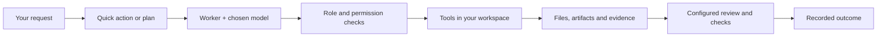

<p align="center">
  <a href="https://enactive.dev/">
    
  </a>
</p>

<h1 align="center">Enactive</h1>

<p align="center"><strong>Give your AI a workspace.</strong><br />Assign the task. Review the result.</p>

<p align="center">
  <a href="https://github.com/StasEdward/Enactive/actions/workflows/build.yml"></a>
  
  
  
</p>

<p align="center">
  <a href="https://enactive.dev/">Website</a> ·
  <a href="https://enactive.app/">Enactive.app</a> ·
  <a href="https://enactive.dev/wiki/">Wiki</a> ·
  <a href="https://remote.enactive.dev/">Remote panel</a> ·
  <a href="https://github.com/StasEdward/Enactive/releases">Releases</a>
</p>

---

**Enactive is a desktop environment for AI agents that work on real projects.** Give it an outcome—investigate a failure, implement a change, improve tests, update documentation—and follow the work from its plan to its tools, files and review.

Choose your models, define what each worker can do, and decide how much autonomy to grant. Your project stays on your machine; local models can handle execution, while an optional cloud model helps with planning or review. You can also run every model phase locally.

## Why Enactive?

Enactive brings the pieces of an agent workflow together in one workspace. Its focus is making delegated work visible, controllable and worth reviewing.

| What matters | What Enactive gives you |
| --- | --- |
| **Use the right model for the job** | Separate planning, execution and review bindings. Combine Ollama, OpenAI-compatible endpoints and Anthropic; route simple and complex plan steps to different models. |
| **Delegate an outcome** | Quick actions for focused work, dependency-aware plans for larger tasks, and optional parallel execution of independent steps. |
| **Keep control of execution** | Developer, Reviewer, Ops and Writer roles with tool allowlists, permission levels and explicit approvals. Choose Observe, Suggest, Execute or Autonomous per workspace. |
| **Review what actually happened** | Tool results, changed files, artifacts and a persistent timeline. Optional model review, evidence citation checks and executable success criteria help assess the result. |
| **Make changes deliberately** | Optional staged file changes with Apply/Reject, plus tracking and rollback of rejected step changes where restoration is supported. |
| **Repeat useful work** | Built-in and custom task templates, execution budgets, background runs, an Inbox and a console host for automation. |
| **Extend the workspace** | Built-in file, shell, Git and Docker tools, plus MCP servers for additional capabilities. |

A successful build is useful evidence. It does not, by itself, prove every requirement was met. Enactive keeps execution results and review decisions visible so you can inspect the basis for “done.”

## How it works



The planner breaks work into steps and dependencies. The orchestrator selects models, runs permitted tools and records their results. Configured reviewers assess the work; code checks evidence references, and deterministic checks can run the commands that define success. History preserves the request, decisions, artifacts and outcome.

The desktop and console share the same execution libraries. The codebase is C# on **.NET 10**, with an **Avalonia** desktop UI and an **ASP.NET Core** remote gateway. Windows is the current desktop build and test target.

## Start a task from your phone. Run it on your computer.

**Remote access connects a browser to your Enactive workspaces.** Use the [remote.enactive.dev service](https://remote.enactive.dev/) to access the web panel, or deploy your own gateway from this repository. The product sites are [enactive.dev](https://enactive.dev/) and [enactive.app](https://enactive.app/).

- Choose a connected computer and workspace, then submit a task.
- Follow its status and timeline, inspect notices, stop a run, and answer supported approval requests.
- Keep execution on the computer that has your project and tools. The desktop connects outward to the gateway—no inbound port needs to be opened on your computer.
- Receive queued events after a connection interruption through the host's local outbox.

The current gateway uses an owner key and revocable device tokens. Remote tasks inherit the workspace's saved policy, with shell commands disabled and staged runs unavailable. The gateway handles task text and results; model providers receive the context needed for their calls.

See the [remote access guide](Docs/wiki/Remote-Access.md) for pairing and permissions, and the [deployment runbook](Docs/REMOTE_OPERATIONS.md) to host your own gateway.

## Get started

Browse [GitHub Releases](https://github.com/StasEdward/Enactive/releases) for packaged builds, or run from source on Windows with the **.NET 10 SDK**:

```powershell
git clone https://github.com/StasEdward/Enactive.git
cd Enactive
dotnet restore Enactive.sln
dotnet build Enactive.sln
dotnet run --project src/Enactive.App.Ui
```

1. **Select a workspace:** an existing project folder.
2. **Connect a model:** open Settings → AI → Providers. Add a local Ollama or OpenAI-compatible endpoint, or configure a cloud provider. Use a model that supports tool calls.
3. **Choose a worker:** assign its model under AI → Team and select a role appropriate to the task.
4. **Start small:** use the read-only Reviewer role to explore the repository. Add independent review and more autonomy as you establish your workflow.

Try this first:

> Explain how this repository is organized. Identify the entry points and test projects, cite the files you inspect, and do not change files.

Then try a focused development task:

> Reproduce this bug, make the smallest fix, add a regression test, and run the relevant tests. Report the commands and results.

The **[wiki](https://enactive.dev/wiki/)** covers setup, model routing, workers, templates, permissions, remote access and operations. Start with [Getting Started](Docs/wiki/Getting-Started.md) or explore [Models and Phases](Docs/wiki/Models-and-Phases.md).

## Build with us

Enactive is actively evolving. If you care about local models, inspectable agent execution or a desktop experience for delegated work, there is plenty to help shape.

Contributions are welcome across:

- **Model integrations:** provider compatibility, tool calling, streaming and reliable usage reporting.
- **Agent behavior:** planning, recovery, evidence quality and reproducible evaluations.
- **Desktop UX:** clearer progress, useful artifact views, accessibility and onboarding.
- **Tools and MCP:** integrations, permission handling and practical workflows.
- **Remote access:** gateway operations, connection recovery and browser usability.
- **Documentation:** tutorials, model configurations and task templates tested on real projects.

Found a problem? [Open an issue](https://github.com/StasEdward/Enactive/issues/new) with the task, relevant model/provider configuration, expected behavior and a minimal reproduction. Redact credentials and private project content from logs. For larger changes, discuss the approach in an issue before opening a pull request.

To check an engine change:

```powershell
dotnet test tests/Enactive.Engine.Tests/Enactive.Engine.Tests.csproj
```

Include a focused regression test when fixing behavior, and update the relevant docs. Gateway integration tests use MySQL; their setup is described in the [operations runbook](Docs/REMOTE_OPERATIONS.md).

### Find your way around

| Directory | What lives here |
| --- | --- |
| [`src/Enactive.Core`](src/Enactive.Core) | Domain models and execution contracts |
| [`src/Enactive.Agents`](src/Enactive.Agents) | Planning, orchestration, routing and review |
| [`src/Enactive.Providers`](src/Enactive.Providers) | Model adapters |
| [`src/Enactive.Tools`](src/Enactive.Tools) | Built-in tools and tool registry |
| [`src/Enactive.Workspace`](src/Enactive.Workspace) | Workspace state, artifacts and persistence |
| [`src/Enactive.App.Ui`](src/Enactive.App.Ui) / [`src/Enactive.App.Console`](src/Enactive.App.Console) | Desktop and console hosts |
| [`src/Enactive.Remote.Gateway`](src/Enactive.Remote.Gateway) / [`src/Enactive.Remote.Host`](src/Enactive.Remote.Host) | Browser gateway and desktop connection |
| [`tests`](tests) · [`Docs`](Docs) · [`brand`](brand) | Tests, documentation and visual identity |

Read the [architecture guide](Docs/wiki/Architecture.md) for the execution flow and project boundaries.

## License

Enactive is licensed under the [Apache License 2.0](LICENSE). Copyright 2026 Edward Stas.

---

<p align="center"><strong>Bring your models. Bring your project. Build the environment where agents can do useful work.</strong></p>
